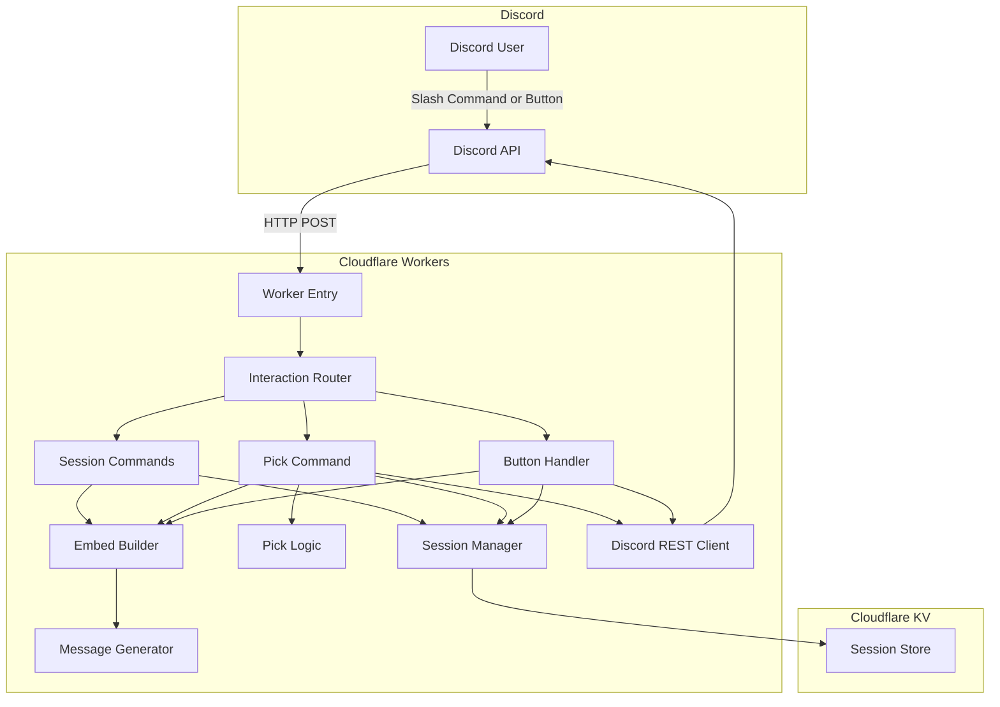
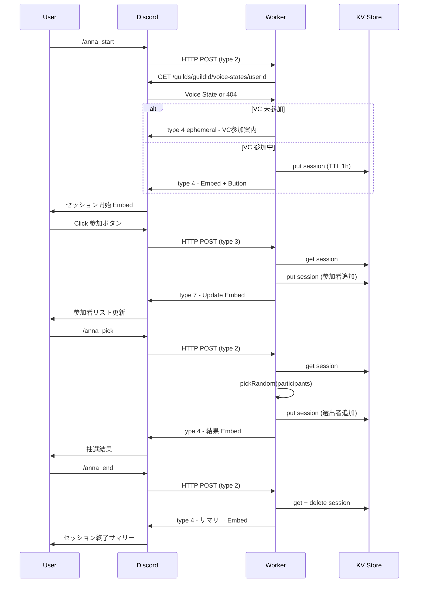
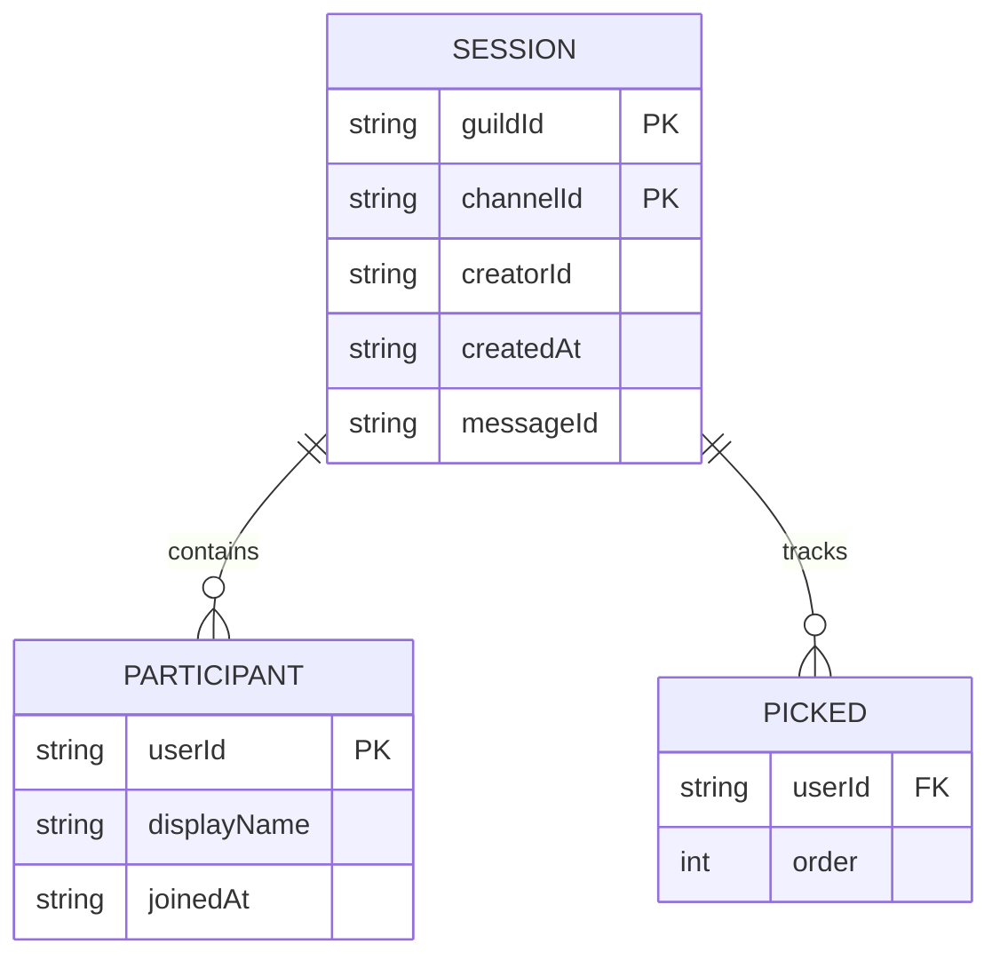

# Design Document: anna-pick-bot

## Overview
**Purpose**: 抽選アンナちゃんは、部活 Discord サーバーで VC 参加中のメンバーがボタンで参加表明し、その中からランダムに発表者・担当者を抽選する Bot を Cloudflare Workers 上のサーバーレスアーキテクチャで提供する。

**Users**: 部活 Discord サーバーの VC 参加メンバーが、LT 発表者・進捗報告順・議事録担当などの決定に利用する。

**Impact**: Discord HTTP Interactions Endpoint と Cloudflare KV を組み合わせ、サーバー不要・無料で運用可能な抽選 Bot を実現する。

### Goals
- ボタンによる参加表明 → 発表可能なメンバーだけを抽選対象にする
- セッション管理により連続抽選・途中参加に対応する
- サーバーレス・無料で運用可能にする
- アンナちゃんキャラクターによる楽しい抽選体験を提供する

### Non-Goals
- VC メンバーの自動一覧取得（REST API 非対応、詳細は `research.md`）
- VC 入退室履歴・出席管理・参加時間集計
- 永続的なデータ保存（セッションは TTL で自動削除）
- 音声読み上げ・AI による動的文章生成
- Web 管理画面

## Boundary Commitments

### This Spec Owns
- スラッシュコマンド `/anna_start`, `/anna_pick`, `/anna_end` の定義と処理
- ボタンインタラクション（参加表明トグル）の処理
- KV ベースのセッション状態管理（参加者リスト・選出者リスト）
- 抽選ロジック（Fisher-Yates ベースの重複なしランダム選出）
- アンナちゃんキャラクターメッセージの定義
- Discord Embed の生成
- Discord HTTP リクエストの署名検証
- スラッシュコマンド登録スクリプト
- GitHub Actions による CI/CD パイプライン

### Out of Boundary
- Discord Gateway（WebSocket）接続
- VC メンバー一覧の自動取得
- セッション間のデータ永続化
- ユーザー認証・認可（Discord のサーバー権限に委譲）
- Bot アイコン・名前の設定（Discord Developer Portal で手動設定）

### Allowed Dependencies
- Discord REST API v10（Interactions Endpoint、Webhook API）
- Cloudflare Workers ランタイム
- Cloudflare KV（セッション状態保存）
- `discord-interactions` npm パッケージ（署名検証）
- `discord-api-types` npm パッケージ（TypeScript 型定義）
- GitHub Actions + `cloudflare/wrangler-action@v3`

### Revalidation Triggers
- Discord API バージョン変更（v10 → v11 等）
- Cloudflare KV 無料枠の変更
- `discord-interactions` のメジャーバージョン更新
- Discord Interactions Endpoint の仕様変更

## Architecture

### Architecture Pattern & Boundary Map



**Architecture Integration**:
- Selected pattern: レイヤードアーキテクチャ（Types → Config → Domain Logic → Interaction Handlers → Worker Entry）
- Domain boundaries: 抽選ロジック（純粋関数）・セッション管理（KV）・メッセージ生成・Discord API 通信が分離
- Dependency direction: Types → Config → Domain（Pick/Session/Message）→ Handlers → Worker Entry

### Technology Stack

| Layer | Choice / Version | Role | Notes |
|-------|------------------|------|-------|
| Runtime | Cloudflare Workers | HTTP リクエスト処理 | 無料枠: 10万リクエスト/日 |
| Language | TypeScript (strict) | 型安全なコード | wrangler でビルド |
| Storage | Cloudflare KV | セッション状態保存 | 無料枠: 読み取り10万/日, 書き込み1,000/日 |
| Discord | discord-interactions + discord-api-types | 署名検証 + 型定義 | Workers 互換 |
| CI/CD | GitHub Actions + wrangler-action@v3 | 自動デプロイ | main push トリガー |
| Testing | Vitest | ユニットテスト | Workers 互換 |

## File Structure Plan

### Directory Structure
```
src/
├── index.ts                    # Worker fetch ハンドラ、署名検証
├── router.ts                   # Interaction タイプ別ルーティング
├── commands/
│   ├── annaStart.ts            # /anna_start ハンドラ
│   ├── annaPick.ts             # /anna_pick ハンドラ
│   └── annaEnd.ts              # /anna_end ハンドラ
├── components/
│   └── joinButton.ts           # 参加ボタンインタラクションハンドラ
├── session/
│   ├── sessionManager.ts       # KV セッション CRUD
│   └── types.ts                # Session 型定義
├── utils/
│   └── pickRandom.ts           # ランダム抽選純粋関数
├── messages/
│   └── annaMessages.ts         # アンナちゃんキャラクターメッセージ定数
├── embeds/
│   ├── sessionEmbed.ts         # セッション Embed 生成
│   └── pickResultEmbed.ts      # 抽選結果 Embed 生成
├── discord/
│   └── api.ts                  # Discord REST API クライアント（followup/edit）
├── config/
│   └── env.ts                  # 環境変数型定義（Env interface）
└── types/
    └── discord.ts              # Discord 関連の共通型定義
scripts/
└── register-commands.ts        # スラッシュコマンド登録スクリプト
tests/
├── pickRandom.test.ts          # 抽選ロジックテスト
├── sessionManager.test.ts      # セッション管理テスト
└── messages.test.ts            # メッセージ生成テスト
.github/
└── workflows/
    └── deploy.yml              # CI/CD ワークフロー
wrangler.toml                   # Workers 設定、KV バインディング
.dev.vars                       # ローカル開発用シークレット（gitignored）
.env.example                    # 環境変数テンプレート
tsconfig.json
package.json
vitest.config.ts
README.md
```

## System Flows

### セッション開始 → 参加表明 → 抽選 → 終了



**Key decisions**:
- セッション開始と抽選結果は type 4（新規メッセージ）で応答
- ボタン操作は type 7（UPDATE_MESSAGE）で元の Embed を更新
- KV 書き込みは毎回 TTL 付きで更新（セッション延長を兼ねる）

## Requirements Traceability

| Requirement | Summary | Components | Interfaces | Flows |
|-------------|---------|------------|------------|-------|
| 1.1-1.6 | セッション開始・ボタン参加表明 | annaStart, joinButton, sessionManager, sessionEmbed | SessionManager, JoinButton handler | セッション開始フロー |
| 2.1-2.5 | セッションからの抽選実行 | annaPick, sessionManager, pickRandom, pickResultEmbed | PickCommand handler, SessionManager | 抽選フロー |
| 3.1-3.4 | 連続抽選・既選出者管理 | annaPick, sessionManager | SessionManager (picked tracking) | 連続抽選フロー |
| 4.1-4.4 | セッション終了 | annaEnd, sessionManager | EndCommand handler | 終了フロー |
| 5.1-5.3 | Bot フィルタリング | joinButton | JoinButton handler (bot check) | - |
| 6.1-6.5 | Embed 表示 | sessionEmbed, pickResultEmbed, annaMessages | EmbedBuilder functions | - |
| 7.1-7.4 | キャラクターメッセージ | annaMessages | Message constants | - |
| 8.1-8.5 | エラーハンドリング | 全 command handlers | Error response helpers | - |
| 9.1-9.3 | バリデーション | annaPick | PickCommand handler | - |
| 10.1-10.2 | 演出拡張性 | annaPick, router | deferReply support | - |
| 11.1-11.3 | セキュリティ | index (verifyKey), config/env | Worker fetch handler | - |
| 12.1-12.3 | CI/CD | deploy.yml | GitHub Actions workflow | - |
| 13.1-13.2 | コマンド登録 | register-commands.ts | Registration script | - |

## Components and Interfaces

| Component | Domain/Layer | Intent | Req Coverage | Key Dependencies | Contracts |
|-----------|-------------|--------|-------------|-----------------|-----------|
| Worker Entry | Runtime | HTTP 受信、署名検証、ルーティング | 11.3 | discord-interactions (P0) | Service |
| Interaction Router | Runtime | インタラクションタイプ別振り分け | - | Worker Entry (P0) | Service |
| annaStart | Command | セッション開始 | 1.1-1.6 | SessionManager (P0), SessionEmbed (P1) | Service |
| annaPick | Command | 抽選実行 | 2.1-2.5, 3.1-3.4, 9.1-9.3 | SessionManager (P0), PickRandom (P0) | Service |
| annaEnd | Command | セッション終了 | 4.1-4.4 | SessionManager (P0) | Service |
| joinButton | Component | ボタン参加表明処理 | 1.2-1.5, 5.1-5.3 | SessionManager (P0) | Service |
| SessionManager | Domain | KV セッション CRUD | 1.1, 2.1, 3.1-3.4, 4.1-4.3 | KV Store (P0) | Service, State |
| pickRandom | Domain | ランダム抽選純粋関数 | 2.1-2.2 | なし | Service |
| annaMessages | Domain | キャラクターメッセージ定数 | 7.1-7.4 | なし | - |
| sessionEmbed | Presentation | セッション Embed 生成 | 1.4, 6.1-6.5 | annaMessages (P1) | Service |
| pickResultEmbed | Presentation | 抽選結果 Embed 生成 | 6.1-6.5 | annaMessages (P1) | Service |
| Discord REST Client | Infrastructure | Webhook followup/edit + Voice State 取得 | 1.6, 10.2 | Discord API (P0) | Service |
| register-commands | Script | コマンド登録 | 13.1-13.2 | Discord API (P0) | - |
| deploy.yml | CI/CD | 自動デプロイ | 12.1-12.3 | wrangler-action (P0) | - |

### Domain Layer

#### SessionManager

| Field | Detail |
|-------|--------|
| Intent | KV ベースのセッション CRUD と参加者・選出者の状態管理 |
| Requirements | 1.1, 1.2, 1.3, 2.1, 3.1, 3.2, 3.3, 4.1, 4.3 |

**Responsibilities & Constraints**
- セッションの作成・取得・更新・削除を KV 経由で行う
- セッションはギルド ID + チャンネル ID でスコープされる（1チャンネル1セッション）
- TTL（デフォルト 3600 秒）で自動期限切れ

**Dependencies**
- External: Cloudflare KV — セッション状態保存 (P0)

**Contracts**: Service [x] / State [x]

##### Service Interface
```typescript
interface SessionManager {
  createSession(guildId: string, channelId: string, creatorId: string): Promise<Session>;
  getSession(guildId: string, channelId: string): Promise<Session | null>;
  addParticipant(guildId: string, channelId: string, userId: string, displayName: string): Promise<Session>;
  removeParticipant(guildId: string, channelId: string, userId: string): Promise<Session>;
  markPicked(guildId: string, channelId: string, userIds: string[]): Promise<Session>;
  deleteSession(guildId: string, channelId: string): Promise<void>;
}
```

##### State Management
```typescript
interface Session {
  guildId: string;
  channelId: string;
  creatorId: string;
  createdAt: string;                       // ISO 8601
  participants: Record<string, Participant>; // userId → Participant
  pickedUserIds: string[];                  // 選出済みユーザー ID（順序保持）
  messageId: string;                        // セッション Embed メッセージ ID
}

interface Participant {
  userId: string;
  displayName: string;
  joinedAt: string;                        // ISO 8601
}
```
- KV キー: `session:{guildId}:{channelId}`
- KV 値: JSON シリアライズされた Session
- TTL: `expirationTtl: 3600`（各 put 時にリセット）
- 同時書き込みリスク: KV は atomic read-modify-write 非対応のため、複数ユーザーの同時ボタン操作で lost update が起こりうる。部活規模（〜20人）では発生確率が低く、操作間隔も数秒あるため許容する。冪等な設計（addParticipant は既存参加者を上書き）で影響を最小化する

#### pickRandom

| Field | Detail |
|-------|--------|
| Intent | Discord に依存しないランダム抽選の純粋関数 |
| Requirements | 2.1, 2.2, 2.4 |

**Contracts**: Service [x]

##### Service Interface
```typescript
/**
 * candidates から count 人を重複なしでランダムに選出する。
 * Fisher-Yates shuffle ベース。
 */
function pickRandom<T>(candidates: readonly T[], count: number): T[];
```
- Preconditions: `candidates.length >= count`, `count >= 1`
- Postconditions: 戻り値の長さは `count`、全要素が `candidates` の部分集合、重複なし
- Invariants: 入力配列を変更しない（immutable）

#### annaMessages

| Field | Detail |
|-------|--------|
| Intent | アンナちゃんキャラクターメッセージの定数集約 |
| Requirements | 7.1, 7.2, 7.3, 7.4 |

**Implementation Notes**
- 成功メッセージ、エラーメッセージ、セッション開始メッセージを分類して定数オブジェクトとして export
- メッセージはテンプレートリテラル関数として提供（ユーザーメンション等の動的パラメータ対応）

### Runtime Layer

#### Worker Entry (index.ts)

| Field | Detail |
|-------|--------|
| Intent | HTTP リクエスト受信、署名検証、Interaction Router への委譲 |
| Requirements | 11.3 |

**Contracts**: Service [x]

##### Service Interface
```typescript
interface Env {
  DISCORD_PUBLIC_KEY: string;
  DISCORD_TOKEN: string;
  DISCORD_APPLICATION_ID: string;
  DISCORD_GUILD_ID: string;
  SESSIONS: KVNamespace;                  // KV バインディング
}

export default {
  async fetch(request: Request, env: Env, ctx: ExecutionContext): Promise<Response>;
};
```

**Implementation Notes**
- `discord-interactions` の `verifyKey()` で署名検証
- 検証失敗時は 401 を返す
- PING（type 1）は即座に PONG で応答
- それ以外は Interaction Router に委譲

#### Interaction Router (router.ts)

| Field | Detail |
|-------|--------|
| Intent | InteractionType と command name / custom_id に基づくハンドラ振り分け |
| Requirements | - |

##### Service Interface
```typescript
type InteractionHandler = (
  interaction: APIInteraction,
  env: Env,
  ctx: ExecutionContext,
) => Promise<Response>;

function routeInteraction(
  interaction: APIInteraction,
  env: Env,
  ctx: ExecutionContext,
): Promise<Response>;
```

### Presentation Layer

#### sessionEmbed / pickResultEmbed

| Field | Detail |
|-------|--------|
| Intent | セッション状態 Embed / 抽選結果 Embed の生成 |
| Requirements | 1.4, 3.4, 6.1-6.5 |

##### Service Interface
```typescript
function buildSessionEmbed(session: Session): APIEmbed;
function buildPickResultEmbed(
  picked: Participant[],
  session: Session,
  vcName: string,
): APIEmbed;
function buildSessionSummaryEmbed(session: Session): APIEmbed;
```

### Infrastructure Layer

#### Discord REST Client (discord/api.ts)

| Field | Detail |
|-------|--------|
| Intent | Discord Webhook API による followup メッセージ送信・メッセージ編集、Voice State 取得 |
| Requirements | 1.6, 10.2 |

##### Service Interface
```typescript
interface DiscordAPI {
  getVoiceState(
    guildId: string,
    userId: string,
  ): Promise<{ channel_id: string } | null>;
  editOriginalResponse(
    applicationId: string,
    interactionToken: string,
    body: RESTPostAPIInteractionFollowupJSONBody,
  ): Promise<void>;
  createFollowup(
    applicationId: string,
    interactionToken: string,
    body: RESTPostAPIInteractionFollowupJSONBody,
  ): Promise<void>;
}
```
- `getVoiceState`: `GET /guilds/{guildId}/voice-states/{userId}` を呼び出す。VC 未参加時は 404 → `null` を返す

## Data Models

### Domain Model



- **Session** がアグリゲートルート
- 1 チャンネルにつき最大 1 セッション
- 参加者と選出者は Session 内に埋め込み

### Physical Data Model (KV)
- **Key pattern**: `session:{guildId}:{channelId}`
- **Value**: JSON（Session 型の Record 表現）
- **TTL**: 3600 秒（各更新時にリセット）
- **サイズ見積り**: 20人参加者で約 2KB（KV の 25MB 値制限に余裕）

## Error Handling

### Error Strategy
全エラーは ephemeral メッセージで応答。ユーザーに内部エラーの詳細を露出しない。

### Error Categories and Responses

| Category | Trigger | Response | Req |
|----------|---------|----------|-----|
| VC 未参加 | `/anna_start` 時に VC にいない | VC 参加案内 | 1.6 |
| セッションなし | `/anna_pick` 時にセッション未開始 | `/anna_start` 案内 | 2.5 |
| 参加者なし | セッション内参加表明者 0 人 | 参加呼びかけ | 8.2 |
| count 超過 | `count` > 未選出参加者数 | 現在の可能人数を表示 | 8.3 |
| 全員選出済み | 未選出参加者 0 人 | 全員選出済み通知 | 3.3 |
| セッション不在 | `/anna_end` 時にセッションなし | セッション不在通知 | 4.4 |
| 予期しないエラー | KV 障害等 | 再試行案内 | 8.4 |

## Testing Strategy

### Unit Tests
- `pickRandom`: 1人/複数人選出、重複なし保証、入力非破壊、count > candidates でのエラー
- `annaMessages`: メッセージテンプレートが正しいメンション形式を含むこと
- `sessionEmbed` / `pickResultEmbed`: Embed 構造が正しいフィールド・フッター・タイムスタンプを含むこと

### Integration Tests
- `SessionManager`: KV モックを使った CRUD テスト（作成・参加追加・参加トグル・選出記録・削除）
- `Interaction Router`: コマンド名 / custom_id に基づくルーティング正確性

### E2E Tests
- `/anna_start` → ボタン → `/anna_pick` → `/anna_end` の一連のフローが正しく動作すること（Discord API モックで検証）

## Security Considerations
- Ed25519 署名検証は全リクエストに対して実行（`discord-interactions` の `verifyKey()`）
- Bot Token は `wrangler secret` で管理、コードにハードコードしない
- KV にはユーザー ID と表示名のみ保存（機密情報なし）
- ephemeral メッセージでエラー詳細の露出を防止
